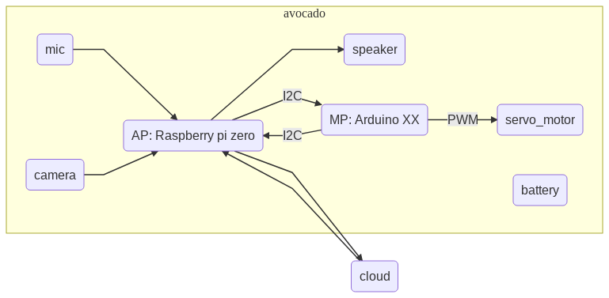
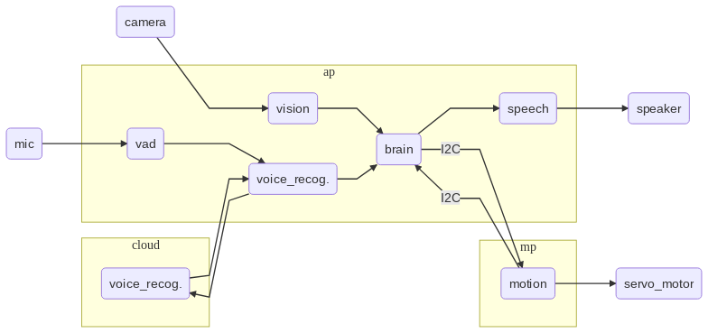

# Avocado
## Overview
xxxxx

## Feature
- Perch on your shoulder
- Voice recognition
- Finding suspicious person
- Text to speech
- Cute

## Hardware architecture

### Hardware requirements
- Raspberry pi zero
- Arduino XX
- Google Cloud Platform

## Software architecture

### Modules
- brain
- vad
- voice_recognition
- vision
- speech
- motion
